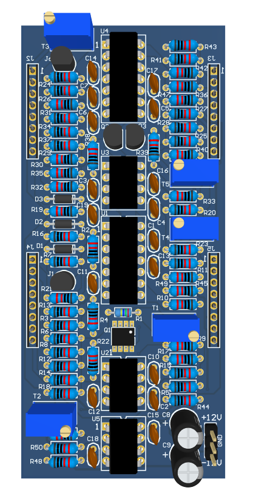
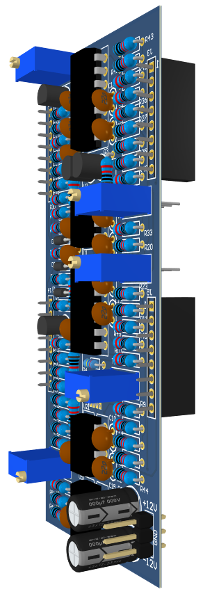
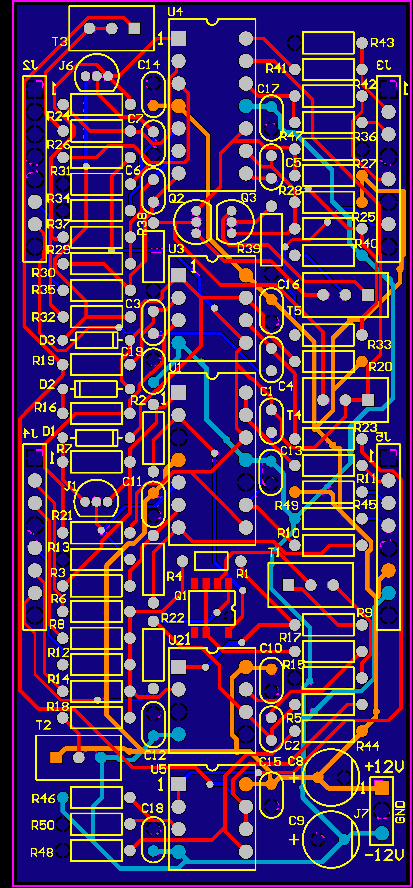
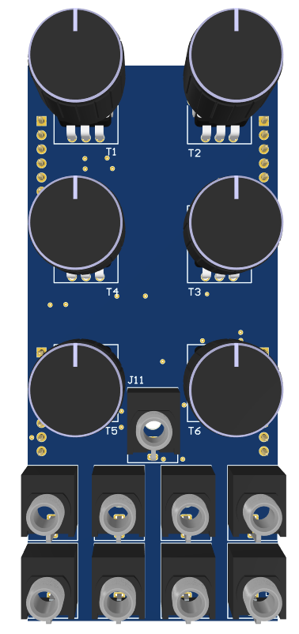
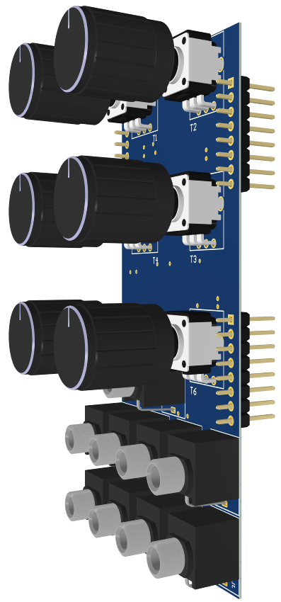

# Voltage-Controlled Oscillator

This repository contains the Altium Designer project for an Analogue Voltage-Controlled Oscillator (VCO) module designed for modular synthesizers. The VCO is completely analogue and includes a exponential converter circuit, a triangle wave based oscillator, a triangle to saw wave converter, a triangle to sine wave converter and a triangle to pulse wave converter. LTSpice was used to design and simulate the circuits and Altium was used for schematic capture and to layout the 2-layer PCBs. A PCB was designed for the actual analogue circuit and a second PCB was designed as a control board to support the dials and audio jacks that connect to the main circuit.

Also included in the repository are PDFs of the schematics, PDFs of the PCB layouts and 3D PDFs of the PCBs.

## PCB Renders and Layout
### Main PCB Board

### Control PCB Board

